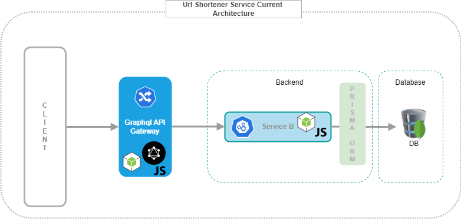
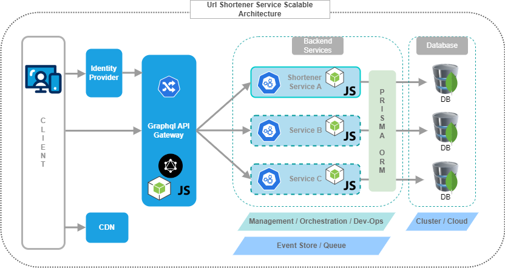

<div align="center">

  <h1>Url Shortener Service</h1>
  
  <p>
    Node Express Typescript Prisma Mongodb Tech Stack

    The service will take long URLs as input and provide shortened, unique aliases that redirect to the original URLs.
  </p>
  


</div>

<br />

<!-- Table of Contents -->
# Table of Contents

- [About the Project](#about-the-project)
  * [Tech Stack](#tech-stack)
  * [Features](#features)
  * [Environment Variables](#environment-variables)
  * [Logging](#logging)
- [Getting Started](#getting-started)
  * [Prerequisites](#prerequisites)
  * [Installation](#installation)
  * [Setup Database Connectivity](#setup-database-connectivity)
  * [Database Name And Collection Name](#database-name-and-collection-name)  
  * [Create Database Resords](#create-database-resords) 
  * [Code Quality Check](#code-quality-check)
  * [Running Tests](#running-tests)
  * [Build Application](#build-application)
  * [Run Application](#run-application)
  * [Run with Docker](#run-with-docker)  
  * [Service API Endpoints](#service-api-endpoints)  

  

<!-- About the Project -->
## About the Project

<!-- TechStack -->
### Tech Stack

- ***Node.js***
- ***Express.js***
- ***Typescript***
- ***npm***
- ***Prisma***
- ***MongoDb***


<!-- Features -->
### Features

- ***Package managament*** -- npm
- ***Testing*** -- Jest and Supertest
- ***Cross-Origin Resource-Sharing*** -- using cors
- ***Secured HTTP Headers*** -- helmet
- ***Logging*** -- winston
- ***Environment variables*** -- dotenv
- ***Compression*** -- gzip
- ***Git hooks*** -- husky
- ***Code quality*** -- Eslint
- ***Code style and formatting*** -- Prettier
- ***Containerization*** -- Docker


<!-- Env Variables -->
### Environment Variables

To run this project, you will need to add the following environment variable to your .env file

`DATABASE_URL`


<!-- Logging -->
### Logging
Below logs are generated under `logs` directory
1. `server.log`
2. `error.log`
3. `exceptions.log`


<!-- Getting Started -->
## Getting Started

<!-- Prerequisites -->
### Prerequisites

This project uses Node.js as runtime environment.

This project uses npm as package manager. to check the latest version of npm use below command

```bash
 npm install -g npm
```

<!-- Installation -->
### Installation

```bash
  git clone <repo>
```

Go to the project directory

```bash
  cd <repo name>
```

```bash
  npm install
```


<!-- Setup Database Connectivity -->
### Setup Database Connectivity

This project uses MongoDB as the database and Prisma as the ORM

Refer below link for prisma mongodb setup
--https://www.prisma.io/docs/getting-started/setup-prisma/start-from-scratch/mongodb-typescript-mongodb

Add mongodb connection url in `.env` file under `DATABASE_URL` parameter

-Ex: `DATABASE_URL = mongodb+srv://<username>:<password>@cluster0.nf1wajz.mongodb.net/myAssignment`

<!-- Database Name And Collection Name -->
### Database Name And Collection Name
-Please note the database name is `myAssignment` for this project

-Please note the collection name is `urls` for this project

```bash
  npx prisma generate
```

<!-- Create database resords -->
### Create Database Resords

Once DB connection is created run below command to add test records in DB

```bash
  npx prisma db seed
```

<!-- Code Quality Check -->
### Code Quality Check

#### Linting

```bash
  # run ESLint
  npm run lint
  
  # fix ESLint errors
  npm run lint:fix
```

#### Prettier
```bash
  # run prettier
  npm code:check

  # fix prettier errors
  npm run code:format
  
  # fix prettier errors in specific file
  npm run code:format:specific-file <file-name>
```
   
<!-- Running Tests -->
### Running Tests

To run tests, run the following command

```bash
  npm run test
```

<!-- Build Application -->
### Build Application

Build the application

```bash
  npm run build
```


<!-- Run Application -->
### Run Application

Start the server in development mode

```bash
  npm run dev
```

Start the server in production mode

```bash
  npm start
```

<!-- Run with Docker -->
### Run with Docker

Build the container

```bash
  docker build . -t url-shortener-service     
```

Start the container

```bash
  docker run -p <port>:3001 -d url-shortener-service    
```

<!-- Service API Endpoints -->
### Service API Endpoints

1. Retrieve Data by Shortened Url (GET): `http://localhost:3001/retrieve/?shortenedUrl=<shortened-url>`


2. Retrieve All Records (GET): `http://localhost:3001/urls`

3. Create Shortened Url record (POST): `http://localhost:3001/create`
    - body params: 
    ```bash
    {
	    "longUrl":"<specific long url>"
    }
    ```

4. Redirect to Long Url by providing Shortened Url (GET): `http://localhost:3001/redirect/?shortenedUrl=<shortened-url>`


<!-- System Architecture -->
## System Architecture

<!-- Project Structure -->
### Project Structure

```bash
__test__/
┣ app.test.ts
┣ url.routes.test.ts
┗ url.service.test.ts
dist/
logs/
prisma/
src/
┣ config/
┃ ┗ config.ts
┣ controllers/
┃ ┗ shortener.controller.ts
┣ middleware/
┃ ┣ logger.ts
┃ ┗ validate.ts
┣ routes/
┃ ┣ index.ts
┃ ┗ url.router.ts
┣ services/
┃ ┗ url.service.ts
┣ utils/
┃ ┣ compressFilter.util.ts
┃ ┗ validationSchema.util.ts
┣ app.ts
┣ env.d.ts
┗ index.ts
```

<!-- Current System Architecture -->
### Current System Architecture




<!-- Scalable System Architecture -->
### Scalable System Architecture


